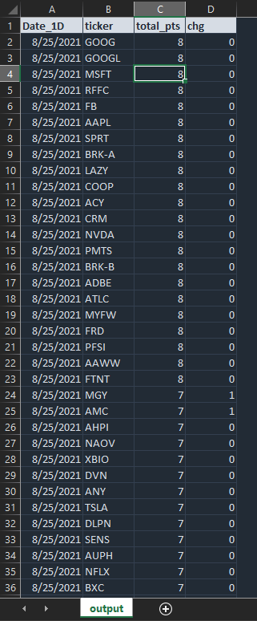

# Ichimoku Screener

This project is meant to give the user a multi-timeframe overview and ticker screener using Ichimoku criteria.

Specifically, this project does the following:

* Takes a list of ticker inputs in the form of a .csv file,  
* Pulls the price data for those tickers,  
* Runs Ichimoku calculations for the 1 day, 3day, and weekly timeframes,  
* Assigns points to the various Ichimoku trading strategy features  
* Adds up those points to give a total points column  
* Calculates the change in total points from the previous day  
* Formats the data in the form of ticker, total points, and daily change in total points  
* Sorts the data so that the ticker with the highest points and the highest increase in points is at the top of the list

This total points criteria will be used for backtesting what is the optimal total points and point change for both entry and exit points for the universe of tickers.

For more information on how Ichimoku is calculated and used, you can visit the site below:
<https://www.investopedia.com/terms/i/ichimoku-cloud.asp>

